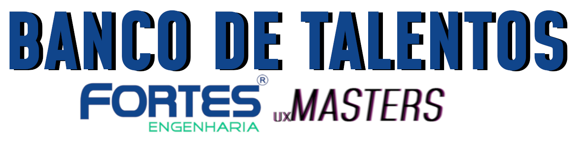

# TRABALHO PROJETO INTEGRADO

Proposto por nossos professores na UVV (Universidade de Vila Velha)
o projeto trata de uma aplicação Web para otimização de procedimentos enfrentados pela empresa FORTES ENGENHARIA. 

 #### Foi divido em três etapas na qual realizamos juntamente com o professor das respectivas disciplinas:
  - UI/UX
  - WEB
 - BANCO DE DADOS
 
---
## UI/UX

Foi criado em um primeiro momento desse trabalho o **WIREFRAME** (prototipo de baixo nivel) do site, e assim estudamos a melhor maneira de formatar os layouts da página, tendo em mente sempre
as heuristicas de nielsen para trazer a melhor usuabilidade. Logo mais, criamos o **MOODBOARD** e o **PROTOTIPO** e vimos com muito mais cor e clareza nossa futura solução e desigh do site. 
> Professora Susiléa Abreu Lima

---
## WEB 

Em cima do **PROTOTIPO** e das *soluções* pensadas nos baseamos para "tirar a ideia do papel" e começar a codar.

Nos dedicamos bastante para criar um site legal, nós gastamos no total 100 horas para criar os 30 arquivos que compõe o trabalho. 

> Professor Guilherme Zucatelli 

---

## BANCO DE DADOS

IN PROGRESS...

> Professor Abrantes Araujo Silva Filho

---

# COMO FOI FAZER ESSE TRABALHO

Fizemos nosso melhor dentro da condição de conhecimento e tempo que tivemos, ficamos gratos com o resultado obtido mas sabendo que temos muito a melhorar ainda!

INTEGRANTES DO TRABALHO 

- João Vitor M Dellarmelina
- Marcos Macêdo 
- Gustavo Muller
- Erick Kato
- Théo Alves

ATENÇÃO!! 

O login e senha de validação do 'index.hmtl' é 
  ______
  ________
|                |
| LOGIN : admin  |
| SENHA : admin  |
| ______________ |
