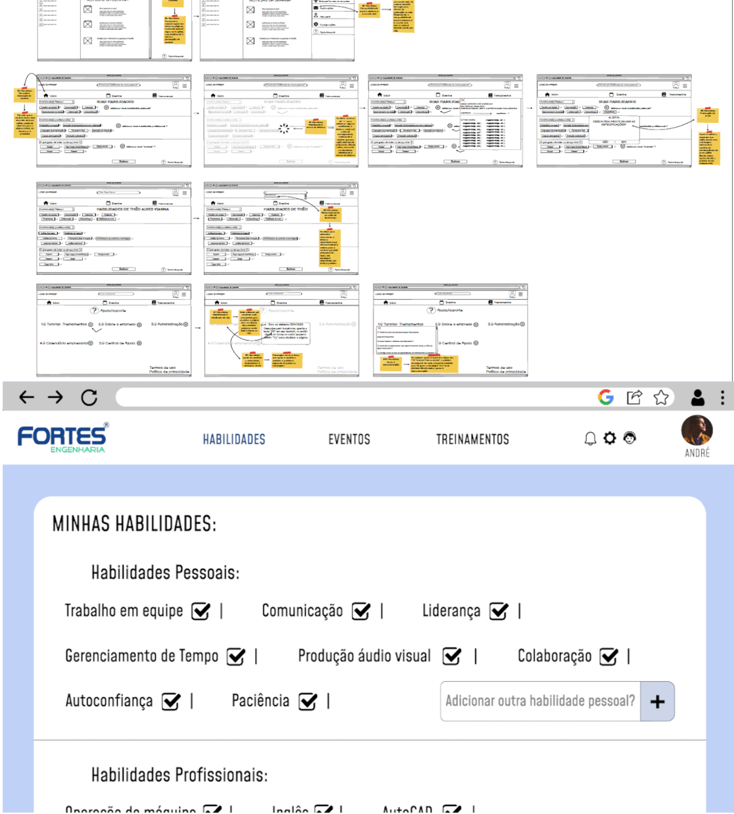
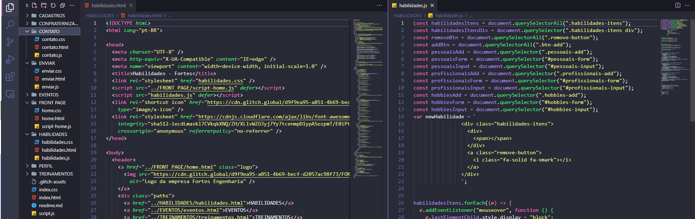
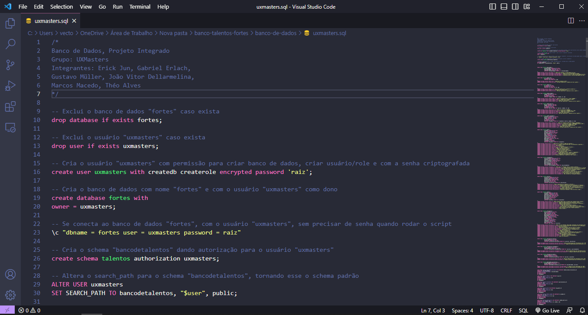

--- 

> ## ATENÇÃO!! 
> 
> O ***login*** e ***senha*** de validação do *index.hmtl* é              
> 
> **LOGIN:** admin  
> **SENHA:** admin 
 
---

---

# TRABALHO PROJETO INTEGRADO - UxMasters

#### Proposto por nossos **professores** na **UVV** (Universidade de Vila Velha)
o projeto trata de uma aplicação Web para otimização de procedimentos enfrentados pela empresa **FORTES ENGENHARIA**. 

 #### Foi divido em três etapas na qual realizamos juntamente com o professor das respectivas disciplinas:
  - UI/UX
  - WEB
  - BANCO DE DADOS
 
---

# UI/UX - *[link](https://github.com/joaodellarmelina/banco-talentos-fortes/tree/6f3321e09cb348dbb1c10877bf09843d09e3e63d/UX-UI)*

Foi criado em um primeiro momento desse trabalho o **WIREFRAME** (prototipo de baixo nivel) do site, e assim estudamos a melhor maneira de formatar os layouts da página, tendo em mente sempre
as heuristicas de nielsen para trazer a melhor usuabilidade. Logo mais, criamos o **MOODBOARD** e o **PROTOTIPO** e vimos com muito mais cor e clareza nossa futura solução e desigh do site. 

> Professora Susiléa Abreu Lima

---

---

# WEB - *[link](https://github.com/joaodellarmelina/banco-talentos-fortes/tree/b56d35c2b5de7589eaab4e5fc8e5c3936176c1e6/WEB)* 

Em cima do **PROTOTIPO** e das *soluções* pensadas nos baseamos para "tirar a ideia do papel" e **começar a codar**.
Nos dedicamos bastante para criar um site legal, nós gastamos no total 100 horas para criar os 30 arquivos que compõe o trabalho. 

> Professor Guilherme Zucatelli

---

---

## BANCO DE DADOS - *[link](https://github.com/joaodellarmelina/banco-talentos-fortes/tree/c5c1cd240dabbb60c3a2fc22d5421f834b419ecb/banco-de-dados)*

Depois da execução de todo projeto WEB nós criamos o banco de dados do banco de talentos, seguimos todas as etapas PROJETO ***CONCEITUAL*** -> ***LÓGICO*** -> CRIAÇÃO DO ***SCRIPT***

> Professor Abrantes Araujo Silva Filho

---

---

# COMO FOI FAZER ESSE TRABALHO

Fizemos nosso melhor dentro da condição de conhecimento e tempo que tivemos, ficamos gratos com o resultado obtido mas sabendo que temos muito a melhorar ainda!

---

## [FAÇA DOWNLOAD DO TRABALHO AQUI](https://github.com/joaodellarmelina/banco-talentos-fortes/archive/refs/heads/main.zip)
## ou dê um
`
git clone https://github.com/joaodellarmelina/banco-talentos-fortes.git
`

# INTEGRANTES DO TRABALHO 

- João Vitor M Dellarmelina
- Marcos Macêdo 
- Gustavo Muller
- Erick Kato
- Théo Alves

